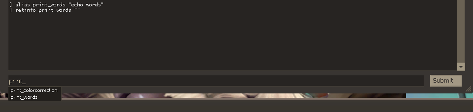

# Console dropdown

By default, any aliases you create won't show up in the console auto-complete dropdown menu. Custom cvars, created with the setinfo command, do appear in the dropdown menu.

By using setinfo, we can get an alias to appear in the dropdown menu as if it were a stock-tf2 command, like so:

```
// alias to use
alias print_words "echo words"

// make it appear in the dropdown menu
setinfo print_words ""
```



If a command should have a description with it, setinfo's second argument also appears in the dropdown menu and that could be used, like so:

```
// alias to use
alias print_words "echo words"

// make it appear in the dropdown menu, with a description
setinfo print_words "   prints out words to console"
```

Unfortunately setinfo's cvar names don't support as many characters as aliases do. Most importantly, setinfo doesn't allow + or - to appear in its names, when they're a valuable feature of aliases.

This may be bypassed by having the description note that it's a +/- command, since the description can contain any characters. For example:
```
// alias to use
alias +print_words "echo more"
alias -print_words "echo words"

// make it appear in the dropdown menu, with a description
setinfo print_words "   +/- command"
```

It is worth noting as well, that in very specific cases involving hidden commands that take the form of "command number" they can't be used with setinfo. Instead of working as expected and running the command, it will set its cvar value to the number argument. The most prominent example:
```
// DON'T DO THIS
// this breaks addcond and makes it unusable
setinfo addcond ""
```

Additionally, there is a limit of 255 player values, as set by setinfo. Any more than that will result in a crash when joining a server.